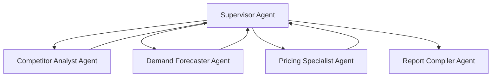

# Capstone Project Submission: SmartSeller AI
**Project Name**: SmartSeller AI — Agent-Driven E-Commerce Intelligence Dashboard  
**Status**: Production-Ready / Fully Verified  

---

## 📖 Executive Summary
**SmartSeller AI** is an advanced, full-stack enterprise e-commerce optimization platform. It utilizes a collaborative network of autonomous AI agents (orchestrated via **LangGraph** and **Google Gemini**) and predictive machine learning models (**Scikit-learn** and **Pandas**) to automatically handle competitor price tracking, inventory demand forecasting, and strategic price optimizations.

---

## 🛠️ Technology Stack
* **Frontend**: React.js (Vite compiler), Tailwind CSS (curated glassmorphism design), Framer Motion (micro-animations), Recharts (data visualizations), Axios (JWT token interceptors).
* **Backend**: Python FastAPI (asynchronous ASGI gateway), SQLAlchemy, PostgreSQL (Docker Compose) / SQLite (Local file fallback via `aiosqlite`), Pydantic v2.
* **AI & Agentic Orchestration**: LangGraph, LangChain, Google Gemini API (Gemini-2.5-flash).
* **Predictive ML Model**: Scikit-Learn Ridge Regression (multi-variate time-series forecaster).
* **Media & Reports**: ReportLab (flowables parser), SMTP (email dispatcher).

---

## ⚙️ Multi-Agent Architecture
SmartSeller AI runs a state-of-the-art multi-agent consensus workflow modeled inside [agents.py](file:///c:/Users/hdsak/Desktop/AI%20agent%20capston%20project/backend/app/services/agents.py) using **LangGraph**:



1. **Supervisor Agent**: Orchestrates state transitions, distributes input data, aggregates node results, and coordinates consensus loops.
2. **Competitor Analyst Agent**: Scrapes and compares competitor price trends, evaluates catalog discrepancies, and triggers alerts.
3. **Demand Forecaster Agent**: Integrates Scikit-learn regressors with Gemini reasoning to predict 7-day demand spikes or overstock/understock risks.
4. **Pricing Specialist Agent**: Weighs competitor positions, margins, and forecasts to recommend mathematically optimized selling prices.
5. **Report Compiler Agent**: Merges agent decisions and analytics into formatted business briefings.

---

## 📁 Key Project Deliverables

All deliverables have been compiled and copied directly to your project root folder for submission:

1. **4K Promotional Demo Video**:
   * [smartseller_4k_promo.mp4](file:///c:/Users/hdsak/Desktop/AI%20agent%20capston%20project/smartseller_4k_promo.mp4) — A 60-second 4K video showing smooth cross-fades, subtitles, and transitions mapping all 7 promotional scenes (struggling sellers, dashboard intro, competitor tracker, demand projections, pricing strategy updates, compiled strategy briefs, and revenue growth).
2. **Horizontal 16:9 Custom YouTube Thumbnail**:
   * [smartseller_ending.png](file:///c:/Users/hdsak/Desktop/AI%20agent%20capston%20project/smartseller_ending.png) — Modern, high-resolution horizontal promotional ending slide card.
   * [smartseller_scene2.png](file:///c:/Users/hdsak/Desktop/AI%20agent%20capston%20project/smartseller_scene2.png) — Sleek dark-theme dashboard UI thumbnail mockup.
   * [smartseller_horizontal_thumbnail.png](file:///c:/Users/hdsak/Desktop/AI%20agent%20capston%20project/smartseller_horizontal_thumbnail.png) — Landscape developer workspace presentation mockup.
3. **Architecture Structure Diagram**:
   * [smartseller_architecture_diagram.png](file:///c:/Users/hdsak/Desktop/AI%20agent%20capston%20project/smartseller_architecture_diagram.png) — A 3D isometric representation of the supervisor/specialist agent system flow.

---

## 🚀 Verification & Setup Guide

### 1. Database Initialization
To support offline robustness, the backend automatically fallbacks to an SQLite file (`smartseller.db`) when native PostgreSQL credentials are unset. To initialize the schema and populate mock histories, run:
```bash
cd backend
.venv\Scripts\python -m app.core.seeder
```

### 2. Startup Server Commands
* **FastAPI Backend**:
  ```bash
  cd backend
  .venv\Scripts\uvicorn app.main:app --port 8000
  ```
* **Vite React Frontend**:
  ```bash
  cd frontend
  npm run dev
  ```
  Navigate to `http://localhost:5173`. Use credentials `demo@smartseller.ai` / `demopassword`.
